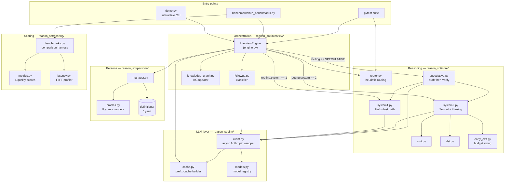
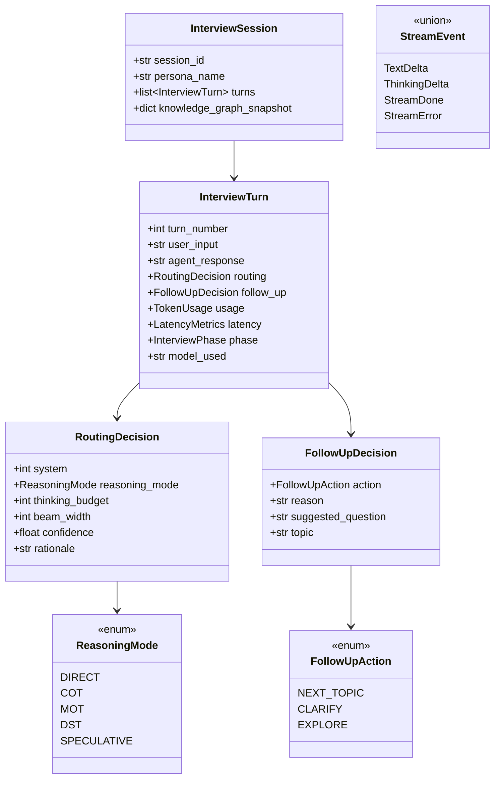
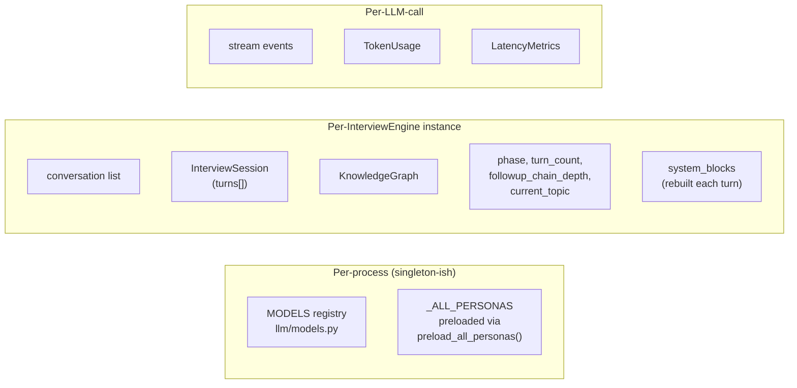

# Architecture

This document describes the component-level architecture of ReasonSoT: what each module is responsible for, how they're wired together, and which interfaces are load-bearing.

For the motivation behind this design, read [`overview.md`](./overview.md) first. For the end-to-end flow of a single turn, see [`workflow.md`](./workflow.md).

## 10,000-foot view

## Module responsibilities

### `reason_sot/interview/`

The **orchestration layer**. Everything that ties per-turn state together lives here.

- **`engine.py` — `InterviewEngine`**: the top-level orchestrator. `process_turn(user_input)` is the only entry point a caller needs. Holds per-session state (conversation history, phase, follow-up chain depth, persona, KG).
- **`followup.py`**: classifies the candidate's response into `NEXT_TOPIC` / `CLARIFY` / `EXPLORE` using a Haiku call with JSON-structured output. Falls back to regex heuristics if the LLM call fails.
- **`knowledge_graph.py`**: in-memory graph of topics, entities, skills, and experiences. Updated each turn via regex extraction. Serializes to a compact summary string that goes into the cached system block.

### `reason_sot/core/`

Pure **reasoning logic**. No session state, no persona logic — these modules take messages in and yield stream events out.

| Module | Role |
|---|---|
| `router.py` | Deterministic routing: user input → `RoutingDecision` (system, reasoning_mode, thinking_budget, beam_width). No LLM call. |
| `system1.py` | Thin wrapper: Haiku, no thinking, 512 max tokens. Used for fast path and speculative drafts. |
| `system2.py` | Sonnet with extended thinking. Injects CoT/MoT/DST instruction into the **last user message** (not system prompt — that would bust prefix cache). Consumes thinking deltas internally. |
| `mot.py` | Matrix-of-Thought prompt builder. `MoTConfig.from_signals(...)` picks broad/deep/balanced. |
| `dst.py` | Domain-Specialized Tree prompt builder with adaptive beam logic. `estimate_beam_from_context(...)` pre-scales the thinking budget. |
| `speculative.py` | S1 draft → confidence gate → optional S2 verify. Combines usage and latency from both calls. |
| `early_exit.py` | `estimate_thinking_budget(complexity, mode, previous_analysis)` pre-call; `analyze_thinking(text)` post-call for adaptive multiplier on next turn. |

### `reason_sot/llm/`

The **LLM boundary**. Everything that talks to Anthropic goes through here.

- **`client.py` — `LLMClient`**: async streaming wrapper. Yields `StreamEvent` = `TextDelta | ThinkingDelta | StreamDone | StreamError`. When `thinking_budget` is set, forces `temperature=1.0` (API requirement).
- **`cache.py`**: builds the 4-block cache-controlled system array and adds cache_control to the last user message. See [`design/prefix-caching.md`](./design/prefix-caching.md).
- **`models.py`**: `ModelTier.FAST / DEEP` → `ModelSpec(model_id, max_output_tokens, supports_thinking)`. Override via `override_models(fast_id, deep_id)` — useful for tests.

### `reason_sot/persona/`

Personas drive what the interviewer *is* — their role, domain, topics to cover, and decision patterns.

- **`profiles.py`**: Pydantic models — `PersonaProfile`, `TopicArea` (with priority 1=MUST / 2=SHOULD / 3=OPTIONAL), `DecisionPattern`.
- **`manager.py`**: loads YAML from `definitions/`, renders `[base_system, persona_prompt]` for the cache builder, suggests persona switches based on coverage signals.
- **`definitions/*.yaml`**: shipped personas — `technical_interviewer`, `behavioral_interviewer`, `career_coach`.

### `reason_sot/scoring/`

Post-hoc analysis. Not on the hot path.

- **`metrics.py`**: four quality scores (depth / breadth / persona consistency / follow-up relevance), weighted into an overall score. Pure Python — no LLM calls during scoring except the optional LLM-as-judge.
- **`latency.py`**: TTFT / total-duration / cache-hit-rate profiler.
- **`benchmarks.py`**: comparative harness for "ReasonSoT vs. S1-only vs. S2-always" configurations.

### Top-level

- **`config.py`** — class-based config (`DevelopmentConfig` / `ProductionConfig` / `TestConfig`). `get_config()` picks via `REASON_SOT_ENV`.
- **`demo.py`** — interactive CLI. Reference implementation of how to wire `LLMClient` + `InterviewEngine` + streaming.
- **`benchmarks/run_benchmarks.py`** — scenario-based benchmark runner.

## Data types (the shared vocabulary)

All shared types live in `reason_sot/types.py`. The load-bearing ones:

## State boundaries

Two things to keep in mind:

1. **`InterviewEngine` holds mutable state.** It's not thread-safe. Create one per session.
2. **`LLMClient` is safe to share** across sessions — it's a thin async wrapper over `anthropic.AsyncAnthropic`.

## Extension points

The design assumes you might want to extend or replace these:

| I want to… | Touch this |
|---|---|
| Add a new reasoning mode | `core/` — add `mymode.py` with a `build_mymode_prompt()`; extend `ReasoningMode` in `types.py`; add a case in `system2._augment_messages_for_mode()` |
| Change routing behavior | `core/router.py` — edit `_compute_complexity_score()` or the pattern lists at the top |
| Add a persona | Drop a YAML into `reason_sot/persona/definitions/` — it'll be picked up by `list_personas()` |
| Change cache block placement | `llm/cache.py::build_system_blocks()` — be careful, this affects hit rates |
| Swap the LLM provider | Replace `llm/client.py` — the rest of the codebase only depends on its public methods and `StreamEvent` types |
| Add a new quality metric | `scoring/metrics.py` — add a `_score_myscore()` and wire into `score_session()` |

## What *not* to put in `core/`

Anything that holds interview state (conversation history, turn count, follow-up chain depth). That state belongs in `InterviewEngine`. `core/` modules should be pure functions over messages + routing decisions.

## Next

- [Turn workflow](./workflow.md) — follow a user utterance through the full pipeline.
- [Routing design](./design/routing.md) — why the heuristic router works and how to tune it.
