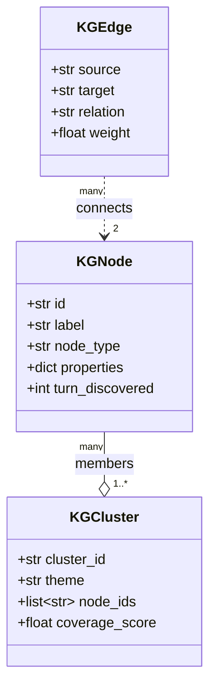

# Design: Knowledge Graph

The in-memory knowledge graph (`reason_sot/interview/knowledge_graph.py`) is how ReasonSoT tracks what the interview has actually *covered* and what's still open. It feeds three things:

1. The **DST mode upgrade** in `InterviewEngine.process_turn` — coverage gap > 0.4 triggers adaptive beam.
2. The **cached KG summary block** in the system prompt — gives Sonnet/Haiku structured context about the conversation.
3. The **persona-switch suggestion** — all must-cover topics hitting coverage ≥ 0.7 triggers a suggested switch.

Based on the Mind-Map approach from the Agentic Reasoning paper (arXiv 2502.04644), scaled down to fit per-turn latency budgets.

## Data model



- **Nodes**: `topic | entity | skill | experience` — things the candidate has mentioned.
- **Edges**: `related_to | used_in | led_to | part_of` — relationships between nodes.
- **Clusters**: thematic groupings derived from the persona's `topic_coverage`. Each cluster has a `coverage_score ∈ [0, 1]` tracking how well that theme has been explored.

## Initialization

When a `KnowledgeGraph` is constructed, it seeds a cluster for each topic in the persona's `topic_coverage`:

```python
def __init__(self, persona: PersonaProfile):
    ...
    for topic in persona.topic_coverage:
        cluster_id = self._normalize_id(topic.name)
        self._clusters[cluster_id] = KGCluster(
            cluster_id=cluster_id,
            theme=topic.name,
            coverage_score=0.0,
        )
```

So for the `technical_interviewer` persona, the graph starts with empty clusters for "Python Fundamentals", "System Design", "Testing", etc. — all at 0% coverage.

## Update flow per turn

```mermaid
flowchart TB
    Start([process_turn step 1]) --> Extract[extract_from_turn<br/>user_text, agent_text, turn#]
    Extract --> R1[regex: extract entities<br/>technical terms, named things]
    Extract --> R2[regex: extract experience markers<br/>'I worked on', 'one time I', etc.]
    Extract --> R3[regex: extract skills<br/>tech stack mentions]
    R1 --> Link[link to persona clusters<br/>by keyword match]
    R2 --> Link
    R3 --> Link
    Link --> Score[update cluster coverage_score<br/>= f(node_count, depth_signals, turn_spread)]
    Score --> Summary[to_summary]
    Summary --> Sys["system_blocks[2]<br/>= KG summary<br/>(cached)"]
```

Extraction is **regex-based**, not LLM-based. This keeps step 1 of `process_turn` effectively free — well under 5 ms. The trade-off: less sophisticated entity resolution than an LLM call could do. Good enough for coverage tracking; not good enough for e.g. detailed skill inference.

## Coverage math

`get_coverage()` returns `{cluster_theme: coverage_score}`:

- Coverage rises with the number of nodes a cluster accumulates.
- Coverage rises with depth signals in those nodes (did the candidate use "for example", "in my experience", "the trade-off"?).
- Coverage rises with turn spread (a topic touched in turns 3, 7, and 11 has more durable coverage than one only touched in turn 3).

`get_coverage_gap_score()` is `mean(1 - coverage_score)` across must-cover clusters — higher = more unexplored must-cover topics.

`get_uncovered_topics()` returns the subset of clusters with `coverage_score < 0.3`, used to inject coverage-gap context into DST prompts.

## Serialization — the `kg_summary` system block

`to_summary()` renders the KG into a compact string injected into the cached system block. Something like:

```
KNOWLEDGE GRAPH SNAPSHOT (turn 5):

COVERED TOPICS:
  - Python Fundamentals (coverage: 0.65)
    mentioned: generators, decorators, asyncio
  - System Design (coverage: 0.20)
    mentioned: Redis, microservices

UNCOVERED:
  - Testing (priority 2)
  - Deployment (priority 3)

RECENT ENTITIES:
  - "URL shortener" (turn 4, experience)
  - "PostgreSQL" (turn 3, skill)

SUGGESTED NEXT: probe Testing (still at 0% coverage)
```

This lives in the **third cache block** (see [prefix-caching.md](./prefix-caching.md)). It changes each turn, but the two preceding blocks (base system + persona) stay stable, so the prefix cache still hits for them.

## Why in-memory and heuristic?

Three reasons:

1. **Latency budget.** A proper LLM-based knowledge graph update would cost ~400 ms per turn. That's half of a voice latency budget, spent on bookkeeping.
2. **Per-session lifetime.** Interviews are bounded — 20 to 30 turns. We don't need persistence, vector search, or graph DBs.
3. **Good-enough signal.** The graph's job is to answer "which topics are still open?" and "what has the candidate mentioned?". Regex extraction handles both with high enough recall; occasional false positives don't matter much for routing.

If you want richer extraction, `knowledge_graph.py` also has an LLM-assisted mode scaffolded in — a Haiku call that extracts `{entities, skills, relations}` as structured JSON (~300 ms). It's not wired into the default `InterviewEngine`. Enabling it is a tuning choice: better graph, +300 ms per turn.

## Persona switching

`InterviewEngine.switch_persona(new_persona_name)` rebuilds the KG from scratch with the new persona's clusters and re-extracts from the existing conversation:

```python
self._kg = KnowledgeGraph(new_persona)
for i in range(0, len(self._conversation) - 1, 2):
    user_msg = self._conversation[i].get("content", "")
    agent_msg = self._conversation[i + 1].get("content", "")
    self._kg.extract_from_turn(user_msg, agent_msg, i // 2 + 1)
```

So after switching from `technical_interviewer` to `behavioral_interviewer`, the KG reflects the *new* persona's topic clusters, with whatever the existing transcript happens to have populated them with.

## Snapshotting

At session end, `end_session()` calls `kg.to_snapshot()` and stores the result on `InterviewSession.knowledge_graph_snapshot`. This is a plain dict of nodes, edges, and cluster scores — suitable for JSON serialization and post-hoc analysis.

## What the KG deliberately doesn't do

- **No vector embeddings.** Similarity between topics is by keyword match, not semantic similarity. Faster, zero dependency, good enough for coverage.
- **No cross-session memory.** Each `InterviewEngine` starts with an empty KG. Cross-session candidate profiles would be a separate concern.
- **No graph reasoning.** Edges exist for context injection, but the engine doesn't do path-based reasoning over them. If you need that, do it offline from the session snapshot.

## Where it plugs into routing

The router (`core/router.py`) itself is KG-agnostic — keeping it stateless. The engine reads KG signals after routing and **upgrades** the reasoning mode:

```python
# After router.route(...)
if routing.system == 2 and routing.reasoning_mode == ReasoningMode.COT:
    gap_score = self._kg.get_coverage_gap_score()
    if gap_score > 0.4:
        beam = estimate_beam_from_context(..., coverage_gap_score=gap_score)
        if beam > 1:
            routing.reasoning_mode = ReasoningMode.DST
            routing.beam_width = beam
```

This keeps `core/router.py` pure (unit-testable without any KG fixtures) while still letting interview state influence reasoning mode.
