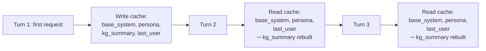
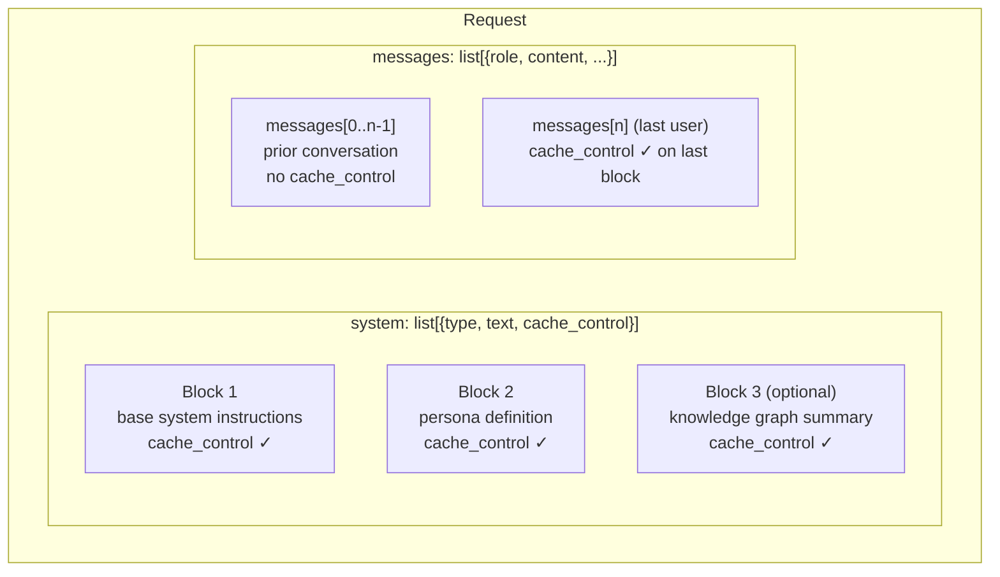
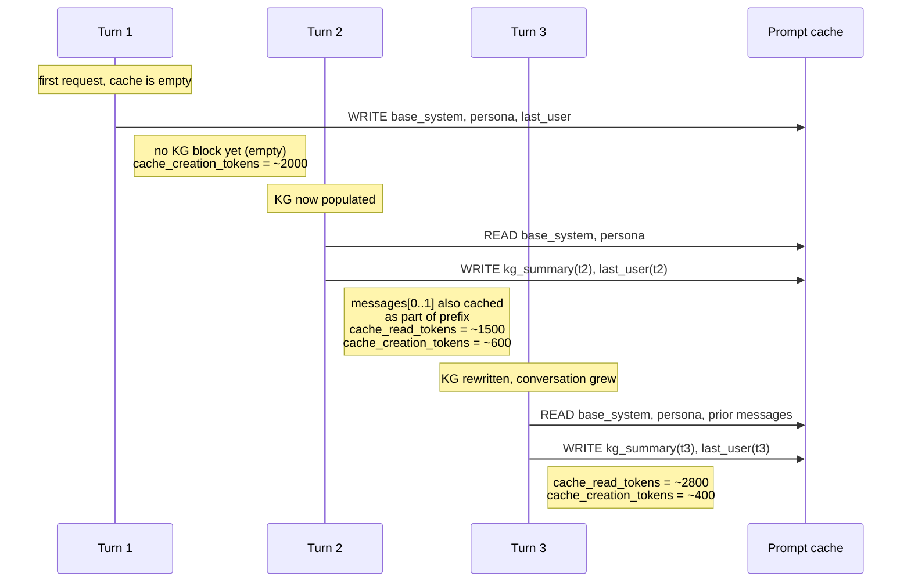

# Design: Prefix Caching

Prefix caching is what makes ReasonSoT economically viable and latency-competitive. Anthropic's prompt cache charges 10% of base input-token cost on cache reads and adds zero to TTFT for cached prefix tokens. Get cache hit rate high → turn-over-turn latency drops and token bills drop.

This doc explains how ReasonSoT structures requests for maximum cache hit rate, using the **4 ephemeral cache breakpoints** Anthropic supports per request.

## The goal



Target: **90%+ cache-read rate by turn 5** in a typical session.

## The 4 cache breakpoints

Anthropic's API allows up to 4 `cache_control: {type: "ephemeral"}` markers per request. ReasonSoT places them like this:



### Block 1 — base system instructions

Defined in `reason_sot/persona/manager.py::BASE_SYSTEM_PROMPT`. Contains the universal interviewer rubric:

> You are an expert interview agent powered by the ReasonSoT reasoning engine. …

This string **never changes** during a session. First cache breakpoint here means every subsequent turn's base-system block is a cache hit.

### Block 2 — persona definition

Rendered by `render_system_prompt(persona)` → `_build_persona_section(persona)`. Contains the persona's role, domain, topic coverage (with priorities and example questions), decision patterns, and probing strategies.

Changes **only** when `InterviewEngine.switch_persona()` is called. In a single-persona session, this is stable → cache hit every turn.

### Block 3 — knowledge graph summary (optional)

Only present after turn 1 (KG is empty on turn 1). Updated each turn by `_rebuild_system_blocks()` in `process_turn`.

This is the *dynamic* system block. Every turn, it's rewritten — so its *content* changes but the block boundary is stable. The preceding two blocks are still cache hits; only this one is "miss-then-write" per turn.

### Block 4 — last user message

`build_messages_with_cache(conversation)` adds `cache_control` to the **last user message** before sending. Combined with the fact that the prior `messages[0..n-1]` are byte-identical to the prior request, this turns most of the conversation history into a cache hit.

## How `build_system_blocks` builds the array

```python
def build_system_blocks(base_system, persona_prompt, kg_summary=None):
    blocks = []
    blocks.append(_add_cache_control({"type": "text", "text": base_system}))
    blocks.append(_add_cache_control({"type": "text", "text": persona_prompt}))
    if kg_summary:
        blocks.append(_add_cache_control({"type": "text", "text": kg_summary}))
    return blocks
```

The order matters: Anthropic's cache works on **prefix identity**. If you reorder or mutate earlier blocks, the cache for everything after is invalidated.

## How `build_messages_with_cache` marks the tail

```python
def build_messages_with_cache(conversation):
    messages = [msg.copy() for msg in conversation]
    for i in range(len(messages) - 1, -1, -1):
        if messages[i].get("role") == "user":
            content = messages[i].get("content", "")
            if isinstance(content, str):
                messages[i]["content"] = [
                    _add_cache_control({"type": "text", "text": content})
                ]
            elif isinstance(content, list) and content:
                last_block = content[-1].copy()
                last_block["cache_control"] = {"type": "ephemeral"}
                messages[i]["content"] = content[:-1] + [last_block]
            break
    return messages
```

Note: only the **last** user message gets a cache marker. The prior messages don't need explicit cache_control to be cached — they get cached for free as part of the prefix when block 4 is the cache boundary.

## Turn-by-turn cache dynamics



Cache hit rate (from `TokenUsage.cache_hit_rate`) converges to 90%+ by turn 4–5 in typical sessions.

## What can bust the cache

Track these if you're touching cache behavior:

| Change | Invalidates |
|---|---|
| Edit `BASE_SYSTEM_PROMPT` | Block 1 + everything after |
| Persona hot-reload | Block 2 + everything after |
| Adding tokens to persona section | Block 2 + everything after |
| Injecting system-level reasoning-mode instructions | Block 2 + everything after ⚠️ |
| Reordering message history | Prefix from the change point forward |
| Changing message content from `str` to `list` | That message's prefix + everything after |
| Changing `thinking` parameters on the model call | Full cache miss (thinking params are in the cache key) |

**Item #4 is the subtle one.** This is why `system2.generate` injects CoT/MoT/DST instructions into the **last user message**, not the system prompt — putting them in the system prompt would change block 2 on every turn that mode changes.

Also note: the cache is **5-minute TTL**. If there's a gap longer than 5 minutes between turns, the whole prefix is re-written on the next turn.

## Thinking and cache

Extended thinking has its own interaction with the cache:

- Cached prefixes are still cached when thinking is enabled.
- Changing `thinking.budget_tokens` between turns does **not** bust the cache for the prefix — only the response generation differs.
- Thinking output tokens are **not** written back into the cache (they're an output, not an input).

## Monitoring

Every `StreamDone` event carries a `TokenUsage` with:

```python
usage.input_tokens              # non-cached inputs this turn
usage.cache_creation_input_tokens   # written to cache this turn (10% upcharge)
usage.cache_read_input_tokens       # read from cache this turn (90% discount)
usage.output_tokens                 # generated tokens
usage.cache_hit_rate                # cache_read / (input + cache_read)
```

`demo.py --verbose` prints this per turn:

```
[S2/cot] TTFT: 850ms | Total: 1800ms | Tokens: 112 | Cache: 87% | Follow-up: clarify
```

And `reason_sot/scoring/latency.py::profile_session` computes aggregate hit rates for benchmark reports.

## Debugging cache misses

If you see low cache hit rates:

1. **Log block boundaries.** Print `len(block["text"])` for each block across turns — identify which one is drifting.
2. **Diff blocks across turns.** The first 3 blocks should be byte-identical turn-to-turn (except block 3 rewriting each turn).
3. **Check message history identity.** If messages from prior turns are being rebuilt (e.g., copies with subtle differences), the prefix cache breaks.
4. **Check the 5-min window.** If you're debugging interactively with long pauses, cache expiry is the likely culprit.

## Why 4 breakpoints, not fewer?

Putting *all* static content in a single block would work — but then the KG summary (which changes every turn) would be a separate block appearing *after* the cache_control, and you'd lose the ability to cache everything up to and including the KG block.

Using 3 breakpoints on the system array lets us cache:

- base + persona permanently
- add KG on top, with its own breakpoint
- add messages on top of that, with the last-user breakpoint

All four layers contribute to a higher sustained cache hit rate than any smaller breakpoint budget would allow.
