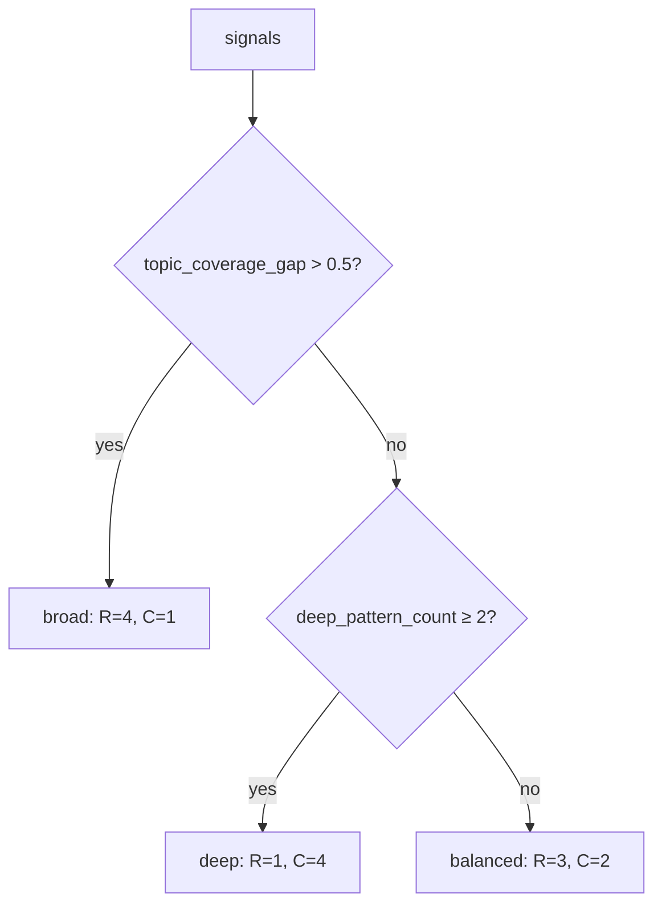
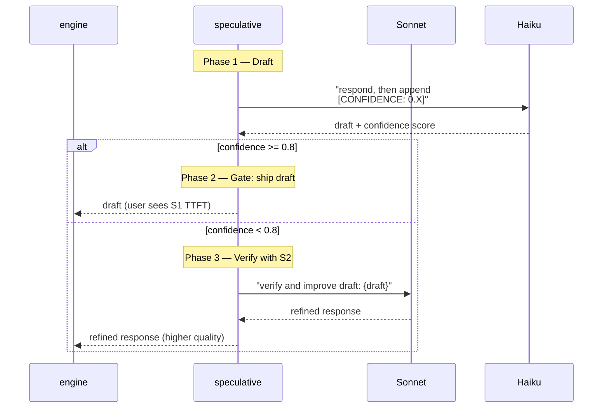

# Design: Reasoning Modes

ReasonSoT supports four distinct reasoning strategies on the System 2 path. All four are implemented as **single-prompt** variants — no fan-out across multiple LLM calls. The breadth/depth exploration happens inside the model's extended-thinking window, and only the synthesized response streams back to the caller.

| Mode | Enum | Purpose | When picked |
|---|---|---|---|
| Direct | `ReasoningMode.DIRECT` | No chain-of-thought, immediate answer | S1 turns (greetings, ack, simple Qs) |
| Chain-of-Thought | `ReasoningMode.COT` | Standard step-by-step | S2, moderate complexity |
| Matrix of Thought | `ReasoningMode.MOT` | R paths × C depth steps | S2, high complexity + ≥2 deep patterns |
| Domain-Specialized Tree | `ReasoningMode.DST` | Adaptive beam, confidence-gated | S2 + KG coverage gap > 0.4 |
| Speculative | `ReasoningMode.SPECULATIVE` | S1 draft + confidence gate + optional S2 verify | Borderline complexity (0.4 – threshold) |

## 1. Direct (System 1)

The fast path. Haiku, no thinking. Used for:

- Greetings, acknowledgments, topic transitions
- Short clarifications
- Speculative drafts (under the hood)

Implementation (`reason_sot/core/system1.py`):

```python
async def generate(client, messages, system, max_tokens=512):
    async for event in client.stream_message(
        messages=messages,
        system=system,
        model_tier=ModelTier.FAST,
        thinking_budget=None,
        temperature=1.0,
    ):
        yield event
```

Typical TTFT: 200–400 ms.

## 2. Chain-of-Thought (CoT)

Standard step-by-step reasoning. The router picks this for moderate-complexity turns that aren't strong enough for MoT.

Implementation: `reason_sot/core/system2.py::COT_INSTRUCTION` is prepended to the **last user message** (not the system prompt — that would bust the prefix cache):

```
Before responding, think step-by-step about:
1. What is the candidate actually saying? (comprehension)
2. What does this reveal about their understanding level? (assessment)
3. What's the most valuable next question to ask? (strategy)

Then give a natural, conversational response with ONE clear follow-up question.
```

Sonnet processes this in extended thinking (budget = `routing.thinking_budget`), then streams only the final text response. Thinking deltas are consumed internally.

## 3. Matrix of Thought (MoT)

Based on **"Matrix of Thought"** (arXiv 2509.03918). The idea: treat reasoning as an R × C matrix where:

- **Rows (R)** = parallel reasoning paths (breadth)
- **Columns (C)** = depth steps per path

```
Path 1:  step 1 → step 2 → step 3 → step 4
Path 2:  step 1 → step 2 → step 3 → step 4     →  synthesis
Path 3:  step 1 → step 2 → step 3 → step 4
```

`R=1, C=many` degenerates to CoT. `R=many, C=1` degenerates to ToT-like exploration. `R>1, C>1` is the full matrix.

### Config selection

`MoTConfig.from_signals()`:



### Prompt (balanced mode)

```
[REASONING STRATEGY: Matrix of Thought — 3 paths x 2 depth steps]

STEP 1 — BREADTH: Generate 3 distinct angles or directions you could take.
For each angle, write a one-line description.

STEP 2 — DEPTH: For each of the 3 angles, reason 2 steps deep:
  - Step 1: What does this angle reveal about the candidate's understanding?
  - Step 2: What's the most incisive follow-up question from this angle?

STEP 3 — SYNTHESIS: Compare the 3 paths. Select the single best follow-up
question that maximizes information gain about the candidate's true capability.

Your spoken response should be natural and conversational — the matrix reasoning
happens in your thinking only. Ask ONE question.
```

The model explores all R×C cells inside its thinking budget, then emits **one** natural question as the visible response. Post-hoc, `parse_mot_response(thinking_text)` can recover how many paths were actually explored and how deep, for scoring.

### Why single-prompt, not multi-call?

A naive ToT implementation would make 3 Haiku calls in parallel, then a synthesis call. For a voice interview, that's:

- 3 × ~400 ms = 1.2 s just for the parallel calls
- Plus synthesis latency
- Plus TTFT for the final response

We can't ship that. Keeping MoT single-prompt puts everything in the thinking window — one network round-trip, TTFT governed only by when the first *visible* token is ready.

## 4. Domain-Specialized Tree (DST)

Based on **"DST"** (arXiv 2603.20267). The core idea: unlike fixed-beam ToT, the *beam width* should adapt to the model's real-time confidence:

- **High confidence** → near-greedy (beam = 1), fast path
- **Low confidence** → expand beam (up to max), thorough exploration

DST claims 26–75% token savings vs. fixed-beam approaches by spending search budget only where it's actually needed.

### Pre-estimated beam

The engine pre-scales the thinking budget with `estimate_beam_from_context`:

```python
def estimate_beam_from_context(previous_confidence, followup_chain_depth, coverage_gap_score, config):
    beam = cfg.min_beam  # 1
    if previous_confidence < cfg.confidence_threshold:  # < 0.5
        beam += 1
    if followup_chain_depth >= 2:
        beam += 1
    if coverage_gap_score > 0.5:
        beam += 1
    return min(beam, cfg.max_beam)  # cap at 3
```

### The prompt (with coverage-gap context)

```
[REASONING STRATEGY: Domain-Specialized Tree — adaptive beam search]
Current topic being explored: {current_topic}
Uncovered topics that need attention: {gaps}

STEP 1 — INITIAL ASSESSMENT (beam=1, greedy):
Think about the candidate's response. What's your confidence level (0-1)?
  - HIGH confidence (>0.5): You clearly understand their level.
    → Go directly to STEP 3 with ONE follow-up direction.
  - LOW confidence (<=0.5): The response is ambiguous, surprising, or incomplete.
    → Expand to STEP 2.

STEP 2 — EXPANDED SEARCH (beam=3, only if low confidence):
Generate 3 distinct follow-up directions:
  Direction 1: [probe deeper on what they said]
  Direction 2: [test from a different angle]
  Direction 3: [explore an adjacent topic]
For each direction, briefly assess:
  - Information gain: how much would we learn?
  - Risk: could this dead-end?
  - Coverage: does this fill a gap in our knowledge map?

STEP 3 — SELECT & RESPOND:
Pick the single best direction. State why.
Generate a natural, conversational follow-up question (2-3 sentences max).

IMPORTANT: If you were confident in Step 1, skip Step 2 entirely — don't waste reasoning tokens.
```

The model is explicitly instructed to **skip** the expensive path when it doesn't need it. This is the adaptive part — it's what makes DST more efficient than fixed-beam ToT for the interview use case, where many turns are "just ask the obvious follow-up" and don't need broad exploration.

### DST vs MoT — when does the engine pick which?

Both are S2 modes but are triggered differently:

| Trigger | Mode picked |
|---|---|
| Complexity ≥ threshold + 0.15 AND ≥ 2 deep patterns | **MoT** |
| Complexity ≥ threshold + 0.15 AND < 2 deep patterns | CoT |
| S2/CoT AND KG coverage gap > 0.4 | **upgraded to DST** (engine step 3) |

So MoT is *triggered by the user's question style* (multiple deep-thinking phrases), while DST is *triggered by the interview's coverage state* (topics left uncovered). Different signals, different purposes.

## 5. Speculative CoT

The latency win on borderline turns. Lives in `reason_sot/core/speculative.py`.

### The three phases



### Why this works

When Haiku says "I'm 0.9 confident in this draft," it usually means the question was well inside its competence. Shipping that draft saves the entire Sonnet latency.

When Haiku says "I'm 0.3 confident" or forgets to emit a score, the engine falls back to Sonnet. Sonnet doesn't regenerate from scratch — it gets the draft plus a `VERIFY_PROMPT`:

```
You are reviewing a draft interview response. The original interviewer draft is below.

Your task: Verify and improve this draft if needed. Consider:
1. Does the follow-up question match the candidate's demonstrated level?
2. Does it reference specific details from their response?
3. Could the question be more incisive or reveal more about the candidate?

If the draft is good: return it as-is (perhaps with minor polish).
If it needs improvement: return an improved version.

Keep it conversational (2-3 sentences, ONE question). Do NOT include any confidence markers.

DRAFT TO REVIEW:
{draft}
```

This is faster than generating from scratch because the model has more to anchor on.

### Combined metrics

`StreamDone` from the speculative path combines both calls:

```python
combined_usage = TokenUsage(
    input_tokens = draft.input + verify.input,
    output_tokens = draft.output + verify.output,
    cache_creation_input_tokens = draft.cache_c + verify.cache_c,
    cache_read_input_tokens = draft.cache_r + verify.cache_r,
)
combined_latency = LatencyMetrics(
    start_time = draft.start_time,
    first_token_time = draft.first_token_time,   # ← user-perceived TTFT
    end_time = verify.end_time,                  # ← true completion
)
```

The reported TTFT is from the **draft** — because that's what the user perceives, even though the full response comes from Sonnet.

## Mode-to-budget mapping

`early_exit.estimate_thinking_budget()` scales the budget by mode:

| Mode | Multiplier | Rationale |
|---|---|---|
| `direct` | 0.0 | No thinking |
| `cot` | 1.0 | Baseline |
| `mot` | 1.5 | Multi-path exploration needs room |
| `dst` | 1.2 | Adaptive beam needs moderate extra |
| `speculative` | 0.5 | Meant to be fast; S2 verify uses its own separate budget |

The base budget comes from a complexity-to-budget interpolation table:

| Complexity | Base budget (tokens) |
|---|---|
| 0.00 | 1024 |
| 0.30 | 2048 |
| 0.50 | 3072 |
| 0.70 | 4096 |
| 0.85 | 6144 |
| 1.00 | 8192 |

Plus adaptive adjustment from the previous turn's `ThinkingAnalysis.recommended_adjustment` — if the model was converging early and repeating itself, next turn's multiplier drops to 0.7.

## Why no multi-call ToT?

ToT's fan-out-then-synthesize pattern is powerful for offline tasks — agents, math problems, code synthesis. For a **voice interview**:

1. **Latency intolerable.** Every extra call is another ~400 ms. Voice needs sub-600 ms TTFT.
2. **No benefit for the use case.** The "best question to ask next" is a synthesis problem, not a search problem — you're not looking for the globally optimal path, you're looking for one good path, quickly.
3. **Thinking tokens are cheaper than another round-trip.** A single call with 8k thinking tokens and careful prompting beats 3 calls × 512 output tokens + synthesis in both latency and cost.

This is why MoT and DST are implemented as single-prompt variants here, not as traditional multi-call tree searches.

## Testing reasoning modes

`tests/test_mot.py`, `tests/test_dst.py`, `tests/test_system2.py` exercise these modes with `MockLLMClient` that returns canned responses and tracks `thinking_budget` per call. See `tests/conftest.py` for the mock wiring.
