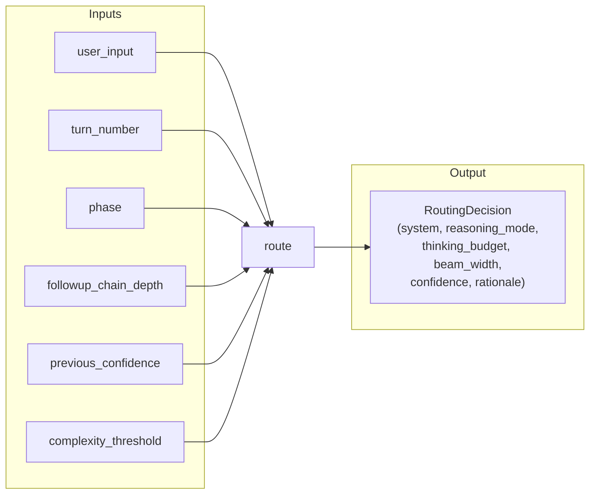
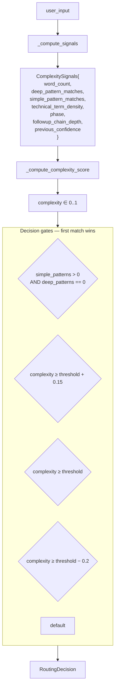
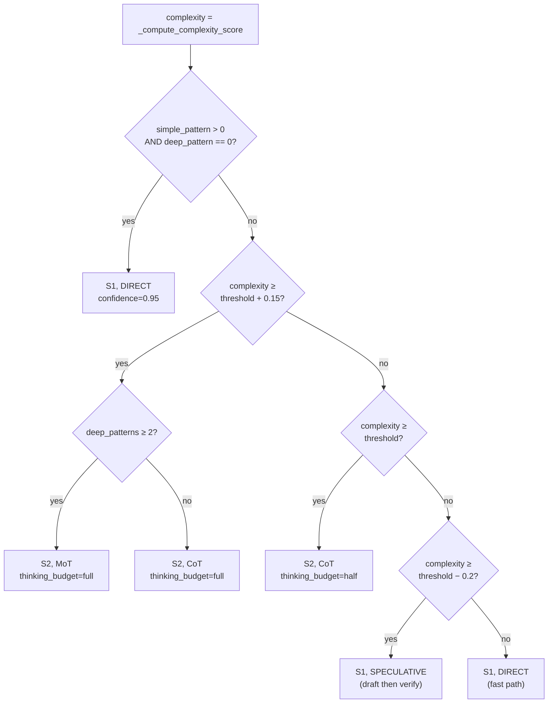

# Design: Heuristic Router

The router (`reason_sot/core/router.py`) is the most performance-critical component in ReasonSoT. It decides, without any LLM call, which path a user utterance takes. Getting this right is what makes sub-500ms TTFT possible for most turns.

## Why heuristic, not LLM-based?

A natural first instinct is to use a "routing LLM" — give Haiku a small prompt and ask it which system to use. That adds ~200 ms TTFT on every turn. Over a 20-turn interview, that's 4 seconds of wasted latency, and the routing decision is often something a regex can make with 95%+ accuracy: greetings are greetings, "walk me through how you'd design X" is always deep.

So the router is **pure Python**: pattern matching + signal scoring. Latency: microseconds.

## Inputs and outputs



## The scoring pipeline



## The five signals

`_compute_signals()` builds a `ComplexitySignals` dataclass with six inputs:

### 1. Word count

Longer candidate responses imply substance — they deserve deeper probing.

| Words | Score delta |
|---|---|
| `< 5` | `−0.20` |
| `5..50` | `0.00` |
| `> 50` | `+0.15` |

### 2. Deep / simple pattern matches

Regexes that strongly signal *deep reasoning needed*:

- `\bwhy\s+(specifically|exactly|do you think)\b`
- `\bhow\s+would\s+you\s+(design|architect|implement|build|scale)\b`
- `\bwalk\s+me\s+through\b`
- `\bexplain\s+(the\s+)?trade-?offs?\b`
- `\bwhat\s+(happens|would happen)\s+(if|when|under)\b`
- `\bcompare\s+and\s+contrast\b`
- `\bdesign\s+(a|an|the)\b`
- …and more — see `DEEP_PATTERNS` in `router.py`.

Regexes that signal *trivial response*:

- `^(yes|no|yeah|yep|ok|okay|got it|i see)\b`
- `^(hi|hello|hey|thanks|good morning)\b`
- `\bcan\s+you\s+repeat\b`

| Signal | Score delta |
|---|---|
| Each deep match | `+0.25` |
| Each simple match | `−0.30` |
| Compound bonus: `≥ 2` deep matches | `+0.15` |

### 3. Technical-term density

The `TECHNICAL_TERMS` set (~60 terms: `async`, `gil`, `sharding`, `raft`, `idempotent`, …) captures jargon that suggests the candidate is operating in a domain that rewards deeper follow-ups.

```
score += (technical_term_count / word_count) * 0.5
```

### 4. Phase

The interview's current phase shifts the complexity baseline:

| Phase | Bias |
|---|---|
| `OPENING` (turns 1–2) | `−0.20` |
| `CORE` | `0.00` |
| `DEEP_DIVE` (chain ≥ 2 or KG gap < 0.3) | `+0.20` |
| `CLOSING` (turn ≥ 25) | `−0.15` |

### 5. Follow-up chain depth

If the agent has been clarifying for two turns running, something subtle is happening — add `+0.15` to push toward S2.

### 6. Previous confidence

If the last turn ended with confidence < 0.6, the router adds `+0.20` — escalate to deeper reasoning.

## The decision gates



With the default `complexity_threshold = 0.6`:

| Complexity range | Decision |
|---|---|
| ≥ 0.75 | S2, MoT (if deep_patterns ≥ 2) or CoT, full budget |
| 0.60 – 0.75 | S2, CoT, half budget |
| 0.40 – 0.60 | **Speculative** — S1 draft, S2 verify if unconfident |
| < 0.40 | S1, direct |

Plus the override at the top: any simple-pattern match with no deep-pattern match short-circuits to S1-direct regardless of score (so "thanks" doesn't accidentally trigger Sonnet).

## DST upgrade in the engine

The router emits CoT by default for standard S2 cases. The engine (`InterviewEngine.process_turn`) can upgrade CoT → DST when the knowledge graph shows significant uncovered topics:

```python
if routing.system == 2 and routing.reasoning_mode == ReasoningMode.COT:
    gap_score = self._kg.get_coverage_gap_score()
    if gap_score > 0.4:
        beam = estimate_beam_from_context(
            previous_confidence=self._last_agent_confidence,
            followup_chain_depth=self._followup_chain_depth,
            coverage_gap_score=gap_score,
        )
        if beam > 1:
            routing.reasoning_mode = ReasoningMode.DST
            routing.beam_width = beam
```

This keeps the router free of KG dependencies (it stays pure), while still letting KG signals influence reasoning-mode selection.

## Tuning

The two knobs that matter:

### `complexity_threshold` (default `0.6`)

- **Lower** (e.g., 0.4) → more traffic goes to S2. Interview feels more thorough but slower.
- **Higher** (e.g., 0.75) → more traffic stays on S1. Faster but shallower probing.

Benchmarks (`make bench`) force this to extremes (`10.0` = S1-only, `0.0` = S2-always) to establish the trade-off curve.

### Pattern lists

Adding a new `DEEP_PATTERN` immediately shifts more traffic to S2. Adding a `SIMPLE_PATTERN` immediately shifts more traffic to S1. Update these when you see misrouted turns in the `_call_log`.

## What the router deliberately doesn't do

- **No sentiment analysis.** "I'm frustrated with this question" doesn't get special handling — the interview style is defined by the persona, not the router.
- **No intent classification.** The router is binary (S1 vs S2) with mode as a bonus. Richer intent is the follow-up classifier's job.
- **No conversation history.** It sees only the current utterance plus a few numeric signals. History influence goes through the engine's `_update_phase()` and `_followup_chain_depth` inputs.

Keeping the router stateless and cheap is what makes it a good first filter. Push richer reasoning to the LLM layer where it belongs.

## Reading the rationale

Every `RoutingDecision.rationale` is human-readable:

```
"Simple pattern match (complexity=0.12)"
"High complexity=0.78, deep_patterns=3"
"Above threshold (complexity=0.65)"
"Borderline (complexity=0.48), using speculative CoT"
"Below threshold (complexity=0.22)"
" (upgraded to DST, beam=2, gap=0.52)"   # appended by engine
```

This is surfaced in `--verbose` mode of `demo.py` and in benchmark reports. Use it to debug routing mistakes.
