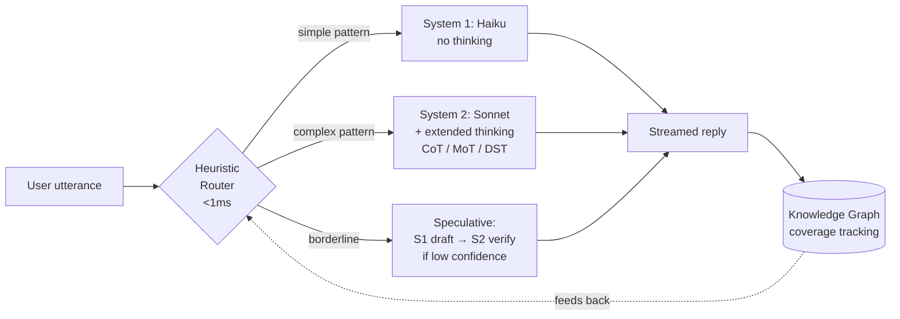

# Overview — Why ReasonSoT exists and how it approaches the problem

## The problem

A voice-based interview agent has three conflicting requirements:

1. **Feels natural** — time-to-first-token (TTFT) must land under ~600 ms, or the conversation feels awkward.
2. **Thinks well** — some questions genuinely need multi-step reasoning: system-design probes, trade-off discussions, adaptive follow-ups based on what the candidate just revealed.
3. **Stays on rails** — the interviewer has a *purpose*: cover a set of topics at a set depth, adapt to the candidate's level, and not get lost in tangents.

A single-model setup forces a bad trade-off. Use Haiku for everyone and you get great latency but shallow questions. Use Sonnet with extended thinking for everyone and you get great questions at 2-4 second latency — unusable for voice. Use Sonnet *without* thinking and you pay for the bigger model without getting the reasoning benefit.

## The key insight

**Most interview turns don't need deep reasoning.** Greetings, acknowledgments, topic transitions, and clarification requests are pattern-matchable. Routing them through a fast Haiku path keeps the conversation snappy. Only the turns that *do* need deep reasoning should pay the Sonnet-plus-thinking cost, and even then the thinking budget should scale to the actual complexity of the question.

This is a classic **dual-process** framing — System 1 (fast, pattern-based, autonomous) vs. System 2 (slow, deliberate, resource-expensive). ReasonSoT applies it at the model-routing level.

## The approach in one picture

Four ideas do the real work:

### 1. Zero-cost routing

`core/router.py` decides between S1, S2, and speculative paths using **only** deterministic Python: regex pattern matches against the user's utterance, a technical-term lexicon, conversation phase, and follow-up-chain depth. No LLM call. Latency: microseconds.

This matters because every LLM call you can avoid is another ~200 ms of TTFT you don't spend. Routing via an LLM "planner" would reintroduce the latency we're trying to avoid.

### 2. Single-prompt reasoning modes

Tree-of-Thought and similar multi-path reasoning frameworks traditionally fan out into N separate LLM calls and then synthesize. That's latency- and cost-prohibitive for an interview.

ReasonSoT keeps all reasoning in **a single LLM call** and uses the thinking-token budget to simulate breadth/depth exploration:

- **CoT** — standard step-by-step.
- **MoT** (Matrix of Thought, 2509.03918) — R parallel paths × C depth steps, explored *in thinking*, synthesized before the visible response. R=1, C=many degenerates to CoT; R=many, C=1 degenerates to ToT-like.
- **DST** (Domain-Specialized Tree, 2603.20267) — adaptive beam: greedy first, expand only if self-assessed confidence is low. 26–75% token savings vs. fixed-beam ToT.

Only the final response streams to the user. Thinking tokens are consumed internally.

### 3. Speculative CoT for borderline complexity

For utterances that are too complex for S1 but not clearly in S2 territory, we run a speculative path:

1. **Draft** — Haiku generates a response and appends a self-assessed confidence score (`[CONFIDENCE: 0.X]`).
2. **Gate** — if confidence ≥ 0.8, ship the draft. The user sees Haiku-speed TTFT.
3. **Verify** — otherwise, Sonnet gets the draft plus a "verify and improve" prompt. Cheaper than generating from scratch.

Net effect: 48–66% latency reduction on medium-complexity turns compared to always using S2.

### 4. Prefix-cached persona + knowledge-graph context

Anthropic's prompt cache gives up to 4 ephemeral cache breakpoints per request. We place them strategically:

1. Base system instructions (rarely changes)
2. Persona definition (changes only on persona switch)
3. Knowledge-graph summary (changes each turn, but only the *tail* of the request is re-processed)
4. Last user message (cache the full conversation prefix)

The knowledge graph itself is an in-memory, heuristic-built structure (no LLM call). Each turn updates nodes/edges from the user's utterance; the serialized summary goes into a cached system block so the model always has structured context about what's been discussed — without re-sending the full transcript uncached each turn.

## What this isn't

- **Not a voice stack.** ReasonSoT is text-in, text-out with streaming. Pair it with an ASR/TTS layer (e.g. Deepgram + ElevenLabs) for actual voice.
- **Not an agent framework.** No tool use, no multi-step planning, no external API integrations. The "agent" here is an interviewer — its job is to ask good questions.
- **Not a fine-tuned model.** All behavior comes from prompting, routing, and prompt-cache placement. Models used are off-the-shelf Claude Haiku 4.5 and Sonnet 4.6.

## How to validate it

The `benchmarks/` harness runs scripted candidate responses through multiple configurations (S1-only, S2-always-with-CoT, full ReasonSoT) and scores each session on:

- **Reasoning depth** — how deeply does the interviewer probe?
- **Reasoning breadth** — what fraction of must-cover topics gets reached?
- **Persona consistency** — does the agent stay in character?
- **Follow-up relevance** — do follow-ups reference what the candidate actually said?

Plus latency (TTFT, total duration) and token economics (cache hit rate, thinking tokens spent). See [`design/reasoning-modes.md`](./design/reasoning-modes.md) for the reasoning-mode rationale and `reason_sot/scoring/metrics.py` for the scoring implementation.

## Next

- [Architecture](./architecture.md) — how these ideas are actually wired up in code.
- [Turn workflow](./workflow.md) — what happens, step by step, for one user utterance.
