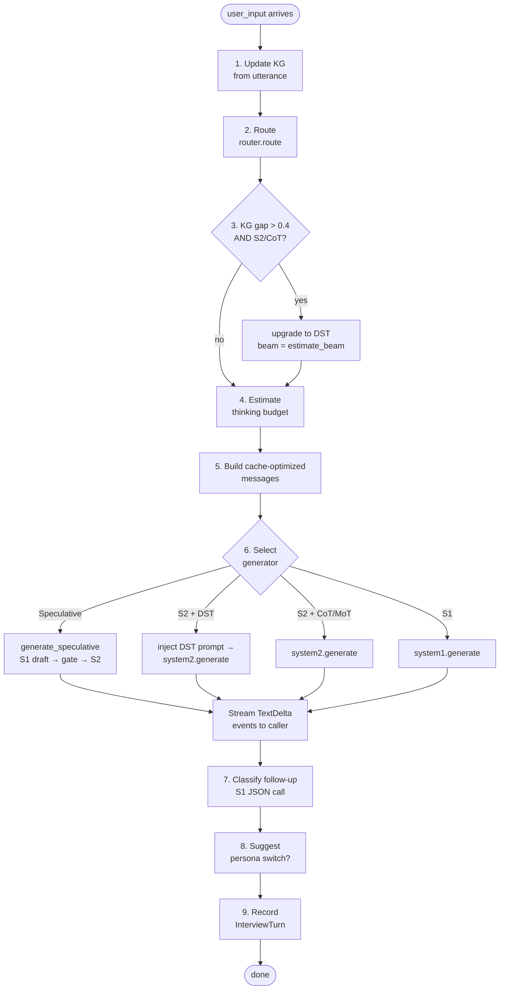
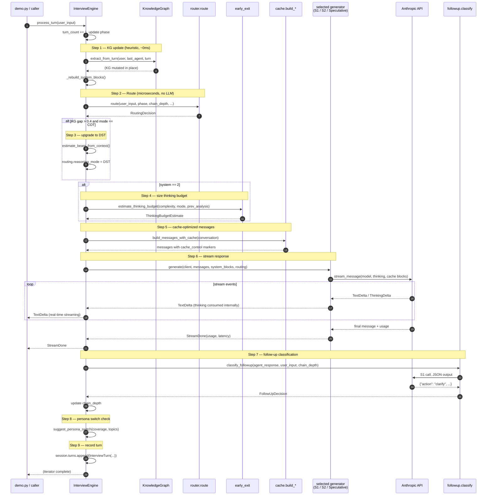
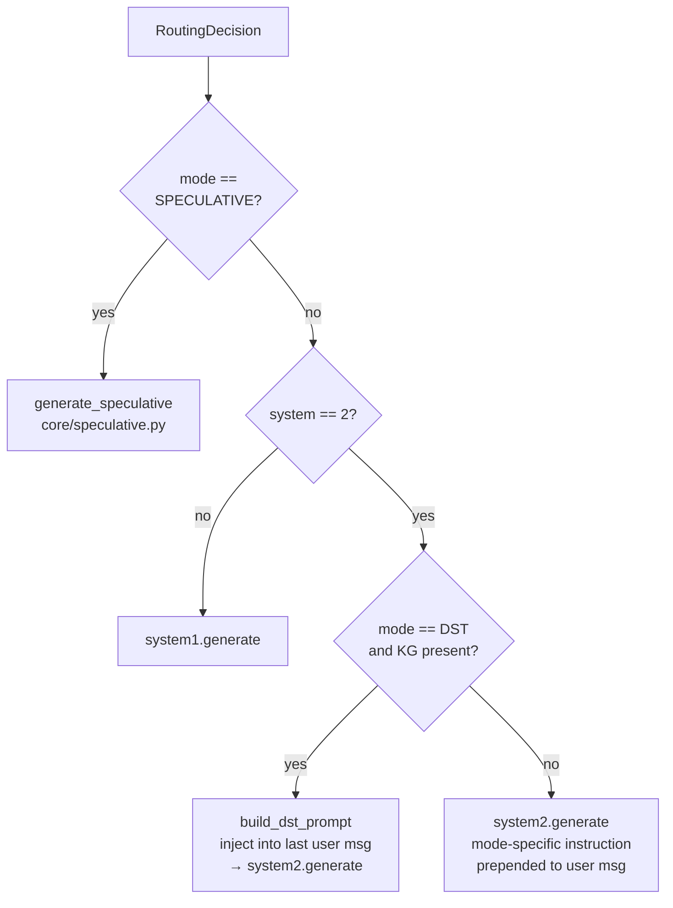
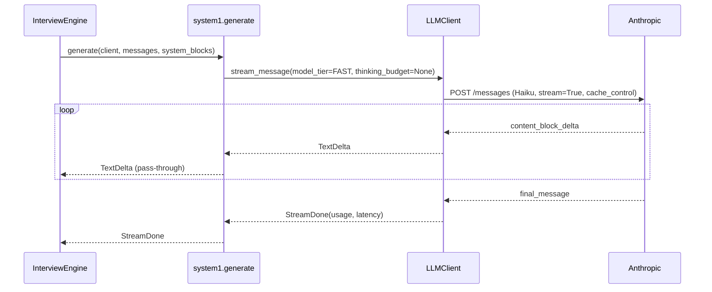
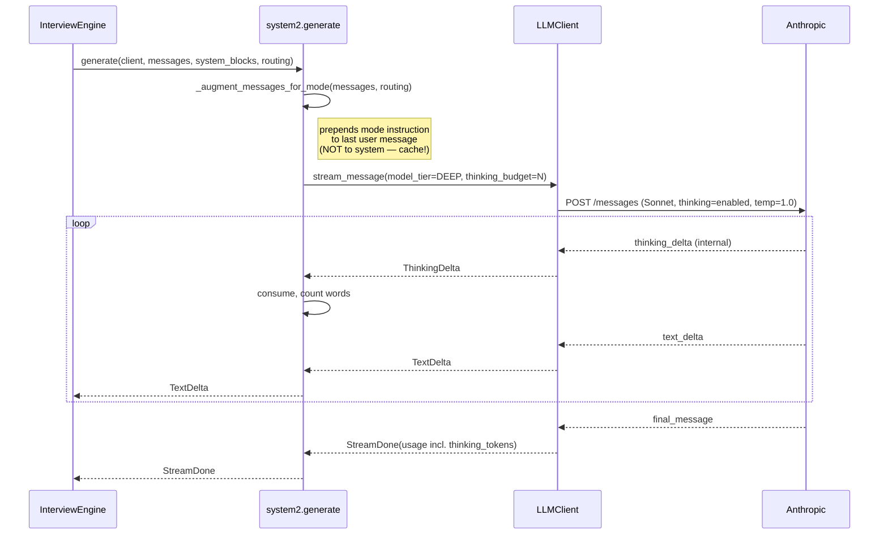
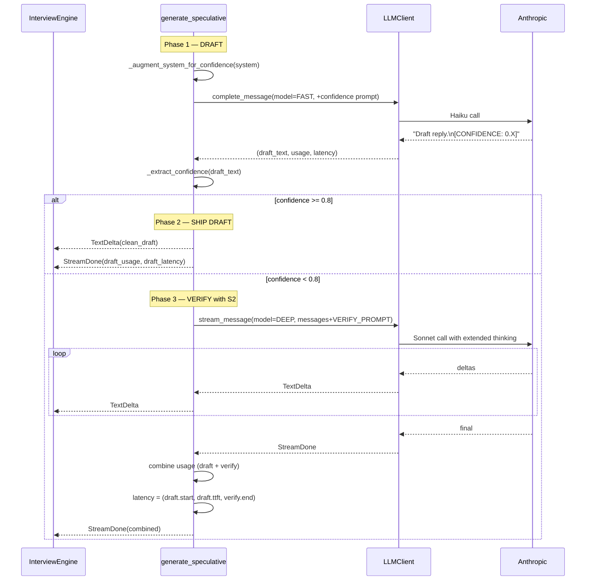
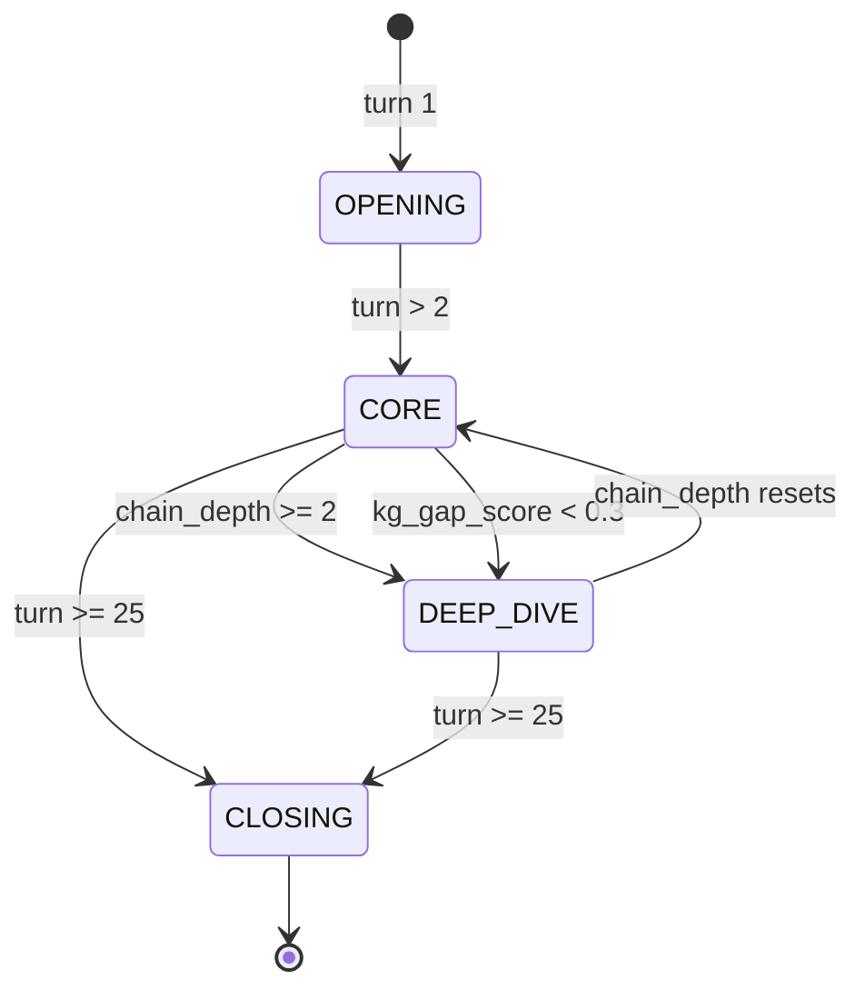

# Turn Workflow

This document walks through what happens end-to-end when a user utterance arrives — step by step, with sequence diagrams. The orchestration entry point is `InterviewEngine.process_turn(user_input)` in `reason_sot/interview/engine.py`.

If you want to read the code alongside the diagrams, open `reason_sot/interview/engine.py:143` (the `process_turn` method).

## The 9 steps



## Sequence diagram — full turn



## The three generator paths

Step 6 selects one of four generators based on `RoutingDecision`:



### System 1 path



Fast path. No thinking. Typical TTFT: 200–400 ms.

### System 2 path (CoT / MoT / DST)



Thinking deltas are consumed internally — never streamed to the caller. The thinking text is captured and passed to `analyze_thinking()` to adjust the next turn's budget multiplier.

### Speculative path



The combined `LatencyMetrics` uses the draft's TTFT (what the user *perceives*) and the verify call's end-time (the true end of generation). This is how 48–66% effective latency reductions are possible on borderline turns.

## State updates per turn

After step 9 completes, these have changed:

| State | Updated by | New value depends on |
|---|---|---|
| `_turn_count` | `process_turn` top | `+1` |
| `_phase` | `_update_phase()` | `turn_count`, `followup_chain_depth`, KG coverage gap |
| `_conversation` | steps 1 + 6 | appended user + assistant messages |
| `_kg` nodes/edges/coverage | step 1 | extracted from `user_input` + last agent reply |
| `_system_blocks` | step 1 (after KG) | `[base_system, persona_prompt, kg_summary]` |
| `_last_thinking_analysis` | step 6 (S2 only) | `analyze_thinking(thinking_text)` |
| `_followup_chain_depth` | step 7 | `+1` on CLARIFY, `0` on NEXT_TOPIC or EXPLORE |
| `_current_topic` | step 7 | from `FollowUpDecision.topic` |
| `_persona_switch_suggested` | step 8 | persona name or `None` |
| `_session.turns` | step 9 | `.append(InterviewTurn(...))` |

## Phase transitions

`_update_phase()` runs at the top of every turn:



Phase is a **routing signal** — it feeds into `router._compute_complexity_score()`:

| Phase | Complexity bias |
|---|---|
| `OPENING` | −0.2 (push toward S1 — rapport building) |
| `CORE` | 0.0 (no bias) |
| `DEEP_DIVE` | +0.2 (push toward S2 — thorough probing) |
| `CLOSING` | −0.15 (back to S1 — wrap up) |

## Streaming contract

`process_turn` is an `AsyncIterator[StreamEvent]`. Callers consume it like this (from `demo.py`):

```python
async for event in engine.process_turn(user_input):
    if isinstance(event, TextDelta):
        print(event.text, end="", flush=True)
    elif isinstance(event, StreamDone):
        # per-turn metrics available in event.usage and event.latency
        ...
    elif isinstance(event, StreamError):
        # LLM call failed — decide whether to retry or bail
        ...
```

Three event types reach the caller:

- **`TextDelta`** — a chunk of the visible response. Stream straight to TTS / stdout.
- **`StreamDone`** — emitted once at the end of each turn. Contains `usage` (tokens + cache hit rate) and `latency` (TTFT, total_ms).
- **`StreamError`** — the LLM call errored. The engine has already logged the problem; handle as you see fit.

`ThinkingDelta` events are **not** yielded to the caller. They're consumed inside `system2.generate` and `speculative.generate_speculative`.

## Failure modes

| What fails | What happens |
|---|---|
| Anthropic API error mid-stream | `StreamError` yielded; partial response (if any) still recorded |
| Follow-up classification fails | Heuristic fallback in `followup._heuristic_classify()` |
| Speculative draft missing confidence marker | Defaults to `confidence=0.5` → triggers verify path |
| Speculative S2 verify fails | Falls back to shipping the draft as-is |
| Persona file missing at `switch_persona` | Returns `False`, keeps current persona |
| KG extraction throws | Logged; turn continues with stale KG summary |

The engine is built to **always produce a turn record** even on failure, so session analytics stay consistent.

## Next

- [Routing design](./design/routing.md) — how step 2 actually works.
- [Reasoning modes](./design/reasoning-modes.md) — what happens inside steps 5–6 for each mode.
- [Prefix caching](./design/prefix-caching.md) — why step 5's cache placement matters.
